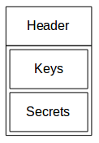

# teensy-hsm
A Teensyduino based Yubikey HSM emulator. This code in under heavy development, some function may not working properly. TeensyHSM is inspired by [YubiHSM Manual](https://www.yubico.com/wp-content/uploads/2015/04/YubiHSM-Manual_1_5_0.pdf) and [python-pyhsm](https://github.com/Yubico/python-pyhsm)

## Architecture


## EEPROM Layout


Description:
- EEPROM header contains header identifier and SHA1 digest of decrypted EEPROM body
- EEPROM body contains 32 entries of keys and 32 entries of secrets 

## Disclaimer
Please read this carefully
- TeensyHSM **is not** intended to replace YubiHSM
- TeensyHSM **is not** FIPS 140-2 certified
- TeensyHSM entropy source is based on sampled ADC noise  while YubiHSM uses PN-junction avalance noise based entropy source. If you need security **please use** YubiHSM instead
- TeensyHSM **is not** tamper resistant and **vulnerable** to side channel attack (DPA, EMF emission pickup)
- Use at your own risk

## Implemented Commands
- Get System Information
- Echo
- Random Generation
- Random Reseed
- ECB Encryption
- ECB Decryption
- ECB decrypt & compare
- Buffer loading
- Buffer random loading
- HMAC-SHA1
- HSM unlock (dummy command)
- Keystore decrypt
- Nonce get
- AEAD generate
- AEAD generate from buffer
- AEAD generate from random
- AEAD decrypt and compare
- AEAD store to db
- AEAD store to db with specified nonce
- Temporary key loading
- Debugging console
- AEAD OTP decode
- Database OTP validate

## Algorithms
Teensy HSM uses the following algorithms:
- AES-128 (ECB, CBC, CCM)
- SHA1-HMAC
- SHA1
- AES-128 based SP800-90 CTR-DRBG

## Setup Commands
- `help`
- `db.erase`
- `db.init`
- `db.load`
- `db.store`
- `db.store.auto`
- `db.status`
- `db.key.show`
- `db.key.delete`
- `db.key.generate`
- `db.key.update`
- `db.secret.show`
- `db.secret.delete`

## Debugging Console
[See](https://github.com/edipermadi/teensy-hsm/wiki/debugging-console)

## How to Flash
- Get Teensy duino [v3.1](http://www.pjrc.com/store/teensy31.html) or [v3.2](http://www.pjrc.com/store/teensy32.html)
- Follow Teensyduino [getting started](http://www.pjrc.com/teensy/td_download.html)
- Clone the project
- Open cloned project with Arduino IDE, set the following parameters:
    - **Board** : Teensy 3.2/3.1
    - **USB Type** : Serial
- Click Compile/Verify and press reset button
- To test flashed software, you can use python-pyhsm 

## How to enter debugging console
- Plug flashed Teensy HSM
- Open /dev/ttyACMx from minicom
- Press tab multiple times until '$' sign appeared
- To quit debugging console, press tab until 'exit' sign appeared

## Debugging session example

```
Welcome to minicom 2.7

OPTIONS: I18n 
Compiled on Feb  7 2016, 13:37:27.
Port /dev/ttyACM0, 23:44:24

Press CTRL-A Z for help on special keys


$ aes.128.ecb.encrypt 00000000000000000000000000000000 10a58869d74be5a374cf867cfb473859
6D251E6944B051E04EAA6FB4DBF78465
$
$ aes.128.ecb.decrypt 6d251e6944b051e04eaa6fb4dbf78465 10a58869d74be5a374cf867cfb473859
00000000000000000000000000000000
$
$ random.dump 10
D6F6F8280A270E8410F0543D0C56E0EF

```
